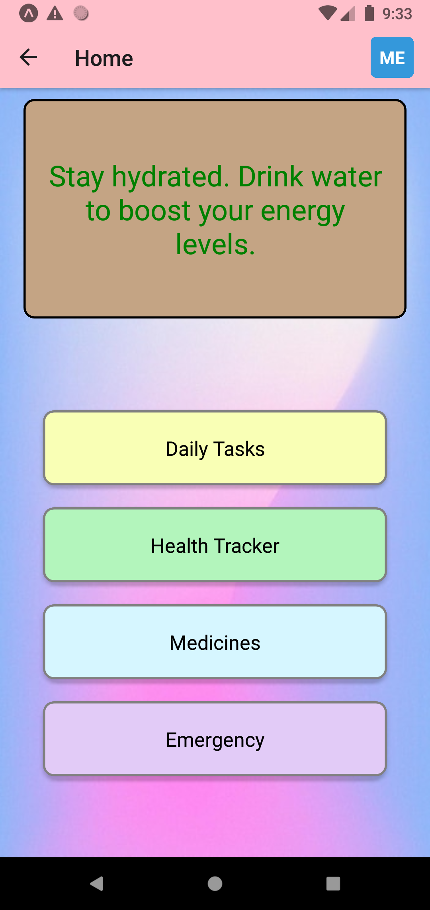
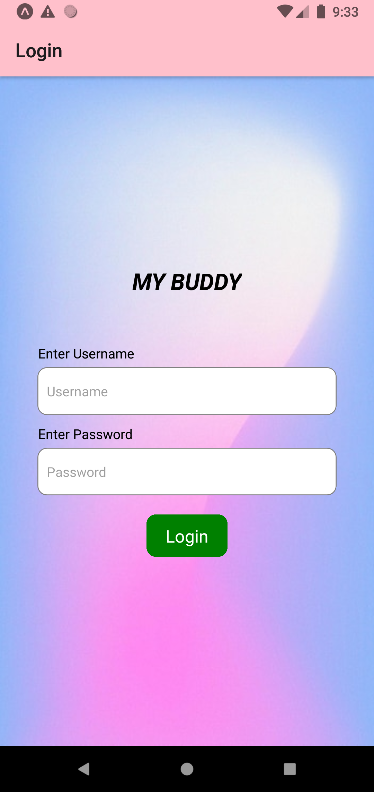

# Kratin Assignment 
# My-Buddy App  

## Overview

My-Buddy is a single stop mobile application designed to help users manage their daily tasks, health, medications, and emergency situations effectively. The app provides a user-friendly interface with various features to enhance productivity and well-being.

## Features

### 1. Daily Tasks

- Organize and manage your daily tasks efficiently.
- Set reminders and prioritize tasks for the day.
- like its time to drink water,have some healthy snacks,take sort brake etc. 

### 2. Health Tracker

- Keep track of your health-related data such as steps, calories, and workouts.
- Keep track on blood pressure . Further we can use fitness band which provide heart rate . Our app fill process the data and alert the relatives and trigger emergency when anything is not normal.
- this can be done by using google fit.
- for alerting system we can use:- Push Notifications: Alerts are sent as push notifications to the relatives' mobile devices.
- SMS or Email: An additional layer of communication may involve sending alerts via SMS or email.
### 3. Medicines

- Set up reminders for taking medications on time.
- Maintain a list of prescribed medicines with dosage information.
- further we can integrate a payment gateway for order of the medicines .

### 4. Emergency

- Access emergency contact numbers for quick assistance.
- Call emergency services directly from the app.
- here i link dialer . on clicking emergency it carry the number to dialer .

## Screenshots

*Caption for Screenshot 1*

*Caption for Screenshot 2*

## Tech Stack

- React Native
- React Navigation
- further i can use ( firebase,aws,bluetooth low energy,nodejs)
## Contributors

- Aniket Mishra ([GitHub Profile](https://github.com/Aniket992))

